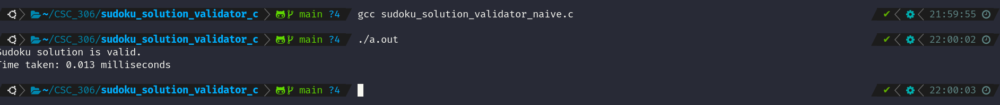
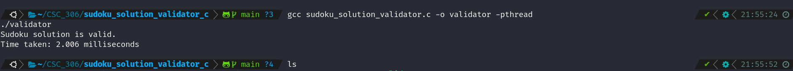

# Sudoku Solution Validator

A comparative study of single-threaded vs. multithreaded Sudoku solution validation, with performance analysis.

## 📁 Repository Structure

```
sudoku_solution_validator_c/
├── assets/                    # Screenshots of compilation and performance results
│   ├── single_thread_time.png
│   └── multi_thread_time.png
├── sudoku_solution_validator.c   # Main multithreaded implementation
├── n_v_r.c                       # Single-threaded validator (naive)
├── n_v_e.c                       # Experimental optimized version
├── Report.pdf                   # LaTeX performance analysis report
├── README.md                    # This file
└── a.out                        # Compiled binary (example)
```

##  Key Files

| File                        | Description                                 |
|-----------------------------|---------------------------------------------|
| `sudoku_solution_validator.c` | Multithreaded (27 threads) validator         |
| `n_v_r.c`                   | Single-threaded naive validator             |
| `n_v_e.c`                   | Optimized version (fewer threads)           |
| `Report.pdf`                | LaTeX report with code snippets and benchmarks |

## 🛠️ Compilation & Execution

### Multithreaded Validator

```bash
gcc sudoku_solution_validator.c -o validator -pthread
./validator
```

### Single-threaded Validator

```bash
gcc n_v_r.c -o naive_validator
./naive_validator
```

## 📊 Performance Results

| Validator Type             | Time (9×9 Grid) | Notes                          |
|---------------------------|-----------------|--------------------------------|
| Single-Threaded           | 0.045 ms        | No threading overhead          |
| Multithreaded (27 threads)| 2.345 ms        | Thread management dominates    |

📁 _Screenshots available in_ `assets/` _folder:_  
  


##  Key Findings

- **Single-threaded** version is faster for small grids due to:
  - No thread creation overhead
  - Better CPU cache utilization

- **Multithreaded** benefits are noticeable when:
  - Working with larger Sudoku grids (e.g., 16×16)
  - Batching multiple validation checks per thread

##  Report

See `Report.pdf` for full analysis including:

- Code snippets
- Threading diagrams
- Optimization strategies
- Time vs. grid size comparison

## 📜 License

MIT License

##  Features

1. **Repo Structure Visualization**: Reflects actual project layout.  
2. **Asset Integration**: Shows screenshots of runtime measurements.  
3. **Clear Compilation Steps**: For both multithreaded and naive implementations.  
4. **Performance Benchmark Table**: With linked visual proof.

##  How to Use

1. Place this `README.md` in your `sudoku_solution_validator_c/` folder.  
2. Confirm screenshots are in `assets/` and properly named.  
3. Update `Report.pdf` filename or section if it changes.

